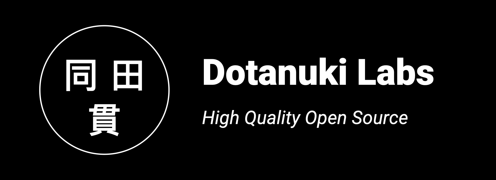

Dotanuki Labs is the home of my open-source projects, including experimental tools, demos, research outcomes and more.

Main areas of interest

- Android/Mobile tooling and applications
- Build Systems and Build Engineering (specially with Gradle)
- CI/CD pipelines and automation
- Security and Supply Chain
- And more!

## Why Dotanuki?

[Dotanuki](https://en.wikipedia.org/wiki/D%C5%8Dtanuki) is a type of Samurai sword. This name was chosen due the impact of [Lone Wolf and Cub](https://en.wikipedia.org/wiki/Lone_Wolf_and_Cub) manga on during my twenties (although this is the only manga series I ever read). 

## More about Ubiratan Soares

- [Twitter](https://twitter.com/ubiratanfsoares)
- [Github](https://github.com/ubiratansoares)
- [LinkedIn](https://www.linkedin.com/in/ubiratanfsoares/)
- [Blog](https://ubiratansoares.dev)

